# Esquema de base de datos — Olimpiadas Especiales Costa Rica

Documento de referencia para generar diagrama Entidad-Relación (ER).  
**Motor:** MySQL 8.x · **ORM:** Sequelize · **BD:** `olimpiadas_db`

**Fuentes:** migraciones en `Backend/migrations/`, modelos en `Backend/models/`, asociaciones en `Backend/config/database.js`.

---

## Convenciones

| Símbolo | Significado |
|---------|-------------|
| **PK** | Primary Key |
| **FK** | Foreign Key |
| **UQ** | UNIQUE |
| **NN** | NOT NULL |
| **DEF** | Valor por defecto |
| **CHK** | Constraint CHECK (MySQL) |

---

## Resumen de relaciones (cardinalidad)

```
roles (1) ──< usuarios
roles (N) ──< rol_permisos >── (N) permisos

usuarios (1) ──< sesiones
usuarios (1) ──< token_blacklist
usuarios (1) ──o consultas
usuarios (1) ──o entrenadores
usuarios (1) ──o voluntarios
usuarios (1) ──o tutores

programas (1) ──< atletas
niveles_habilidad (1) ──< atletas
disciplinas (1) ──< entrenadores
disciplinas (1) ──< competiciones
disciplinas (1) ──< inscripciones (vía inscripciones.disciplina_id)

atletas (1) ──< atleta_alergias
atletas (1) ──< atleta_condiciones
atletas (1) ──< atleta_dispositivos
atletas (1) ──< atleta_documentos
atletas (1) ──< atleta_medicamentos
atletas (N) ──< competicion_atletas >── (N) competiciones
atletas (1) ──< inscripciones

voluntarios (1) ──< voluntario_areas

registros_pendientes (1) ──< registro_pendiente_documentos
```

---

## Tablas (27)

### 1. `roles`

| Columna | Tipo MySQL | NN | PK | UQ | DEF | Notas |
|---------|------------|----|----|----|-----|-------|
| id | INT AUTO_INCREMENT | Sí | Sí | | | |
| nombre | VARCHAR(50) | Sí | | Sí | | Solo letras y guiones (validación app) |
| descripcion | TEXT | No | | | | |
| created_at | DATETIME | Sí | | | CURRENT_TIMESTAMP | |

---

### 2. `permisos`

| Columna | Tipo MySQL | NN | PK | UQ | DEF | Notas |
|---------|------------|----|----|----|-----|-------|
| id | INT AUTO_INCREMENT | Sí | Sí | | | |
| nombre | VARCHAR(100) | Sí | | Sí | | |
| ruta | VARCHAR(200) | Sí | | | | Ruta API |
| metodo | ENUM('GET','POST','PUT','PATCH','DELETE') | Sí | | | | |
| descripcion | TEXT | No | | | | |

---

### 3. `rol_permisos` (tabla pivote)

| Columna | Tipo MySQL | NN | PK | FK | UQ | ON DELETE | ON UPDATE |
|---------|------------|----|----|-----|----|-----------|-----------|
| id | INT AUTO_INCREMENT | Sí | Sí | | | | |
| rol_id | INT | Sí | | roles(id) | | CASCADE | CASCADE |
| permiso_id | INT | Sí | | permisos(id) | | CASCADE | CASCADE |

---

### 4. `usuarios`

| Columna | Tipo MySQL | NN | PK | UQ | FK | DEF | CHK (migración) |
|---------|------------|----|----|----|-----|-----|-----------------|
| id | INT AUTO_INCREMENT | Sí | Sí | | | | |
| rol_id | INT | Sí | | | roles(id) RESTRICT | | |
| nombre | VARCHAR(100) | Sí | | | | | LENGTH(trim) >= 2 |
| apellido | VARCHAR(100) | Sí | | | | | LENGTH(trim) >= 2 |
| cedula | VARCHAR(20) | No | | Sí | | | |
| correo_electronico | VARCHAR(150) | Sí | | Sí | | | |
| password_hash | VARCHAR(255) | Sí | | | | | |
| telefono | VARCHAR(15) | No | | | | | |
| direccion | TEXT | No | | | | | |
| pais | VARCHAR(50) | No | | | | | |
| fecha_nacimiento | DATE | No | | | | | <= hoy; >= hoy-120 años |
| genero | ENUM('Masculino','Femenino','Otro') | No | | | | | |
| avatar_url | VARCHAR(500) | No | | | | | |
| reset_password_token | VARCHAR(255) | No | | | | | Migración 20260519150000 |
| reset_password_expires | DATETIME | No | | | | | Migración 20260519150000 |
| status | ENUM('ACTIVO','INACTIVO','SUSPENDIDO') | Sí | | | 'ACTIVO' | |
| fecha_registro | DATETIME | Sí | | | CURRENT_TIMESTAMP | |
| updated_at | DATETIME | Sí | | | CURRENT_TIMESTAMP ON UPDATE | |

---

### 5. `sesiones`

| Columna | Tipo MySQL | NN | PK | FK | ON DELETE | ON UPDATE | DEF |
|---------|------------|----|----|-----|-----------|-----------|-----|
| id | INT AUTO_INCREMENT | Sí | Sí | | | | |
| usuario_id | INT | Sí | | usuarios(id) | CASCADE | CASCADE | |
| token | TEXT | Sí | | | | | |
| ip_address | VARCHAR(45) | No | | | | | |
| user_agent | TEXT | No | | | | | |
| expira_en | DATETIME | Sí | | | | | |
| activa | BOOLEAN | Sí | | | | | true |
| created_at | DATETIME | Sí | | | | | CURRENT_TIMESTAMP |

---

### 6. `token_blacklist`

| Columna | Tipo MySQL | NN | PK | FK | ON DELETE | ON UPDATE | DEF |
|---------|------------|----|----|-----|-----------|-----------|-----|
| id | INT AUTO_INCREMENT | Sí | Sí | | | | |
| usuario_id | INT | Sí | | usuarios(id) | CASCADE | CASCADE | |
| token | TEXT | Sí | | | | | |
| motivo | VARCHAR(50) | No | | | | | |
| created_at | DATETIME | Sí | | | | | CURRENT_TIMESTAMP |

---

### 7. `atletas`

| Columna | Tipo MySQL | NN | PK | UQ | FK | DEF | CHK |
|---------|------------|----|----|----|-----|-----|-----|
| id | INT AUTO_INCREMENT | Sí | Sí | | | | |
| nombre | VARCHAR(100) | Sí | | | | | LENGTH >= 2 |
| primer_apellido | VARCHAR(100) | Sí | | | | | LENGTH >= 2 |
| segundo_apellido | VARCHAR(100) | No | | | | | |
| fecha_nacimiento | DATE | Sí | | | | | <= hoy; edad 8-120 años |
| genero | ENUM('Masculino','Femenino','Otro') | Sí | | | | | |
| telefono | VARCHAR(20) | No | | | | | |
| correo_electronico | VARCHAR(150) | No | | | | | |
| cedula | VARCHAR(50) | No | | | | | Ampliado en modelo |
| pais | VARCHAR(100) | No | | | | | |
| direccion | TEXT | No | | | | | |
| emergencia_nombre | VARCHAR(150) | No | | | | | |
| emergencia_telefono | VARCHAR(20) | No | | | | | |
| tutor_nombre | VARCHAR(100) | No | | | | | |
| tutor_apellido | VARCHAR(100) | No | | | | | |
| tutor_relacion | VARCHAR(50) | No | | | | | |
| tutor_telefono | VARCHAR(20) | No | | | | | |
| tutor_correo | VARCHAR(150) | No | | | | | |
| tutor_pais | VARCHAR(100) | No | | | | | |
| tutor_cedula | VARCHAR(50) | No | | | | | |
| equipo | VARCHAR(100) | No | | | | | |
| experiencia | VARCHAR(255) | No | | | | | |
| proximos_retos | TEXT | No | | | | | |
| fecha_registro | DATETIME | No | | | CURRENT_TIMESTAMP | |
| programa_id | INT | No | | | programas(id) SET NULL | CASCADE |
| nivel_habilidad_id | INT | No | | | niveles_habilidad(id) SET NULL | CASCADE |

*Nota: columnas extra respecto a migración inicial `20260511000001` provienen de uso en app / sync Sequelize.*

---

### 8. `atleta_alergias`

| Columna | Tipo MySQL | NN | PK | FK | ON DELETE | ON UPDATE |
|---------|------------|----|----|-----|-----------|-----------|
| id | INT AUTO_INCREMENT | Sí | Sí | | | |
| atleta_id | INT | Sí | | atletas(id) | CASCADE | CASCADE |
| tipo_alergia | VARCHAR(100) | Sí | | | | |
| especificacion | TEXT | No | | | | |

---

### 9. `atleta_condiciones`

| Columna | Tipo MySQL | NN | PK | FK | ON DELETE | ON UPDATE |
|---------|------------|----|----|-----|-----------|-----------|
| id | INT AUTO_INCREMENT | Sí | Sí | | | |
| atleta_id | INT | Sí | | atletas(id) | CASCADE | CASCADE |
| condicion | VARCHAR(150) | Sí | | | | |

---

### 10. `atleta_dispositivos`

| Columna | Tipo MySQL | NN | PK | FK | ON DELETE | ON UPDATE |
|---------|------------|----|----|-----|-----------|-----------|
| id | INT AUTO_INCREMENT | Sí | Sí | | | |
| atleta_id | INT | Sí | | atletas(id) | CASCADE | CASCADE |
| tipo | ENUM('movilidad','medico','vida','comunicacion') | Sí | | | | |
| nombre | VARCHAR(150) | Sí | | | | |

---

### 11. `atleta_documentos`

| Columna | Tipo MySQL | NN | PK | FK | ON DELETE | ON UPDATE | DEF |
|---------|------------|----|----|-----|-----------|-----------|-----|
| id | INT AUTO_INCREMENT | Sí | Sí | | | | |
| atleta_id | INT | Sí | | atletas(id) | CASCADE | | |
| nombre_documento | VARCHAR(150) | Sí | | | | | |
| tipo_documento | ENUM('Identificación','Certificado Médico','Seguro','Autorización','Otro') | Sí | | | | | |
| ruta_archivo | VARCHAR(500) | Sí | | | | | storage_key o ruta lógica |
| nombre_original | VARCHAR(255) | No | | | | | Cifrado AES |
| mime_type | VARCHAR(100) | No | | | | | |
| storage_key | VARCHAR(500) | No | | | | | |
| iv | VARCHAR(32) | No | | | | | Cifrado GCM |
| auth_tag | VARCHAR(32) | No | | | | | |
| hash_sha256 | VARCHAR(64) | No | | | | | |
| tamano_bytes | INT | No | | | | | |
| fecha_subida | DATETIME | No | | | CURRENT_TIMESTAMP | |

---

### 12. `atleta_medicamentos`

| Columna | Tipo MySQL | NN | PK | FK | ON DELETE | ON UPDATE |
|---------|------------|----|----|-----|-----------|-----------|
| id | INT AUTO_INCREMENT | Sí | Sí | | | |
| atleta_id | INT | Sí | | atletas(id) | CASCADE | CASCADE |
| nombre | VARCHAR(150) | Sí | | | | |
| dosis | VARCHAR(100) | Sí | | | | |
| frecuencia | VARCHAR(100) | Sí | | | | |

---

### 13. `programas`

| Columna | Tipo MySQL | NN | PK | UQ | DEF |
|---------|------------|----|----|----|-----|
| id | INT AUTO_INCREMENT | Sí | Sí | | |
| nombre | VARCHAR(100) | Sí | | Sí | |
| provincia | VARCHAR(100) | No | | | |
| activa | BOOLEAN | Sí | | | true |

---

### 14. `disciplinas`

| Columna | Tipo MySQL | NN | PK | UQ | DEF |
|---------|------------|----|----|----|-----|
| id | INT AUTO_INCREMENT | Sí | Sí | | |
| nombre | VARCHAR(100) | Sí | | Sí | |
| descripcion | TEXT | No | | | |
| activa | BOOLEAN | Sí | | | true |

---

### 15. `niveles_habilidad`

| Columna | Tipo MySQL | NN | PK | UQ |
|---------|------------|----|----|-----|
| id | INT AUTO_INCREMENT | Sí | Sí | |
| nombre | VARCHAR(50) | Sí | | Sí |
| descripcion | TEXT | No | | |

---

### 16. `inscripciones`

Inscripción de atleta a programa + disciplina + nivel.

| Columna | Tipo MySQL | NN | PK | FK | UQ | DEF | CHK |
|---------|------------|----|----|-----|----|-----|-----|
| id | INT AUTO_INCREMENT | Sí | Sí | | | | |
| atleta_id | INT | Sí | | atletas(id) | | | |
| disciplina_id | INT | Sí | | disciplinas(id) | | | |
| programa_id | INT | Sí | | programas(id) | | | |
| nivel_id | INT | Sí | | niveles_habilidad(id) | | | |
| estado | ENUM('PENDIENTE','APROBADA','RECHAZADA') | Sí | | | 'PENDIENTE' | |
| notas | TEXT | No | | | | | |
| fecha_inscripcion | DATETIME | Sí | | | CURRENT_TIMESTAMP | |
| fecha_aprobacion | DATETIME | No | | | | | |
| updated_at | DATETIME | Sí | | | CURRENT_TIMESTAMP ON UPDATE | |

**UQ compuesta:** `(atleta_id, disciplina_id, programa_id)` — nombre `unique_inscripcion_compuesta`

**CHK:** `chk_inscripciones_fecha` — si `estado = 'APROBADA'` entonces `fecha_aprobacion IS NOT NULL`; si no, `fecha_aprobacion IS NULL`

---

### 17. `consultas` (formulario contacto)

| Columna | Tipo MySQL | NN | PK | FK | DEF | CHK |
|---------|------------|----|----|-----|-----|-----|
| id | INT AUTO_INCREMENT | Sí | Sí | | | |
| usuario_id | INT | No | | usuarios(id) | | |
| nombre | VARCHAR(100) | Sí | | | | LENGTH >= 2 |
| correo | VARCHAR(150) | Sí | | | | regex email |
| asunto | VARCHAR(100) | Sí | | | | LENGTH >= 3 |
| mensaje | TEXT | Sí | | | | LENGTH >= 10 |
| leida | BOOLEAN | Sí | | | false |
| fecha | DATETIME | Sí | | | CURRENT_TIMESTAMP |

---

### 18. `tutores`

| Columna | Tipo MySQL | NN | PK | UQ | FK | DEF |
|---------|------------|----|----|----|-----|-----|
| id | INT AUTO_INCREMENT | Sí | Sí | | | |
| usuario_id | INT | No | | Sí | usuarios(id) | |
| nombre | VARCHAR(100) | Sí | | | | |
| apellido | VARCHAR(100) | Sí | | | | |
| cedula | VARCHAR(20) | No | | Sí | | |
| telefono | VARCHAR(15) | No | | | | |
| correo_electronico | VARCHAR(150) | No | | | | |
| direccion | TEXT | No | | | | |
| pais | VARCHAR(50) | No | | | | |
| relacion_con_atleta | VARCHAR(50) | No | | | | |
| nombre_atleta | VARCHAR(150) | No | | | | |
| ocupacion | VARCHAR(100) | No | | | | |
| motivacion | TEXT | No | | | | |
| experiencia_necesidades_especiales | BOOLEAN | Sí | | | | false |
| status | ENUM('ACTIVO','INACTIVO') | Sí | | | 'ACTIVO' |
| fecha_registro | DATETIME | Sí | | | CURRENT_TIMESTAMP |
| updated_at | DATETIME | Sí | | | CURRENT_TIMESTAMP ON UPDATE |

---

### 19. `entrenadores`

| Columna | Tipo MySQL | NN | PK | UQ | FK | DEF | CHK |
|---------|------------|----|----|----|-----|-----|-----|
| id | INT AUTO_INCREMENT | Sí | Sí | | | | |
| usuario_id | INT | No | | Sí | usuarios(id) | | |
| disciplina_id | INT | No | | | disciplinas(id) | | |
| nombre | VARCHAR(100) | Sí | | | | | LENGTH >= 2 |
| apellido | VARCHAR(100) | Sí | | | | | LENGTH >= 2 |
| cedula | VARCHAR(20) | No | | Sí | | | |
| fecha_nacimiento | DATE | No | | | | | adulto >= 18 años |
| genero | ENUM('Masculino','Femenino','Otro') | No | | | | | |
| telefono | VARCHAR(15) | No | | | | | |
| correo_electronico | VARCHAR(150) | No | | | | | |
| direccion | TEXT | No | | | | | Solo en modelo |
| pais | VARCHAR(100) | No | | | | | Solo en modelo |
| emergencia_nombre | VARCHAR(150) | No | | | | | Solo en modelo |
| emergencia_telefono | VARCHAR(20) | No | | | | | Solo en modelo |
| anios_experiencia | TINYINT UNSIGNED | No | | | | | 0-99 |
| certificaciones | TEXT | No | | | | | |
| horario_disponible | VARCHAR(200) | No | | | | | |
| afeccion_salud | BOOLEAN | Sí | | | | false |
| detalle_salud | TEXT | No | | | | | |
| equipo | VARCHAR(100) | No | | | | | Solo en modelo |
| proximos_retos | TEXT | No | | | | | Solo en modelo |
| status | ENUM('ACTIVO','INACTIVO','PENDIENTE') | Sí | | | 'PENDIENTE' |
| fecha_registro | DATETIME | Sí | | | CURRENT_TIMESTAMP |
| fecha_aprobacion | DATETIME | No | | | | | |
| created_at | DATETIME | Sí | | | CURRENT_TIMESTAMP |
| updated_at | DATETIME | Sí | | | CURRENT_TIMESTAMP ON UPDATE |

---

### 20. `voluntarios`

| Columna | Tipo MySQL | NN | PK | UQ | FK | DEF | CHK |
|---------|------------|----|----|----|-----|-----|-----|
| id | INT AUTO_INCREMENT | Sí | Sí | | | | |
| usuario_id | INT | No | | Sí | usuarios(id) | | |
| nombre | VARCHAR(100) | Sí | | | | | LENGTH >= 2 |
| apellido | VARCHAR(100) | Sí | | | | | LENGTH >= 2 |
| cedula | VARCHAR(20) | No | | Sí | | | |
| direccion | TEXT | No | | | | | Solo en modelo |
| pais | VARCHAR(100) | No | | | | | Solo en modelo |
| fecha_nacimiento | DATE | No | | | | | adulto >= 18 |
| genero | ENUM('Masculino','Femenino','Otro') | No | | | | | |
| telefono | VARCHAR(15) | No | | | | | |
| correo_electronico | VARCHAR(150) | No | | | | | |
| otra_area | TEXT | No | | | | | |
| disponibilidad | VARCHAR(200) | No | | | | | |
| experiencia_previa | TEXT | No | | | | | |
| equipo | VARCHAR(100) | No | | | | | Solo en modelo |
| proximos_retos | TEXT | No | | | | | Solo en modelo |
| status | ENUM('ACTIVO','INACTIVO','PENDIENTE') | Sí | | | 'PENDIENTE' |
| fecha_registro | DATETIME | Sí | | | CURRENT_TIMESTAMP |
| fecha_aprobacion | DATETIME | No | | | | | |
| created_at | DATETIME | Sí | | | CURRENT_TIMESTAMP |
| updated_at | DATETIME | Sí | | | CURRENT_TIMESTAMP ON UPDATE |

---

### 21. `voluntario_areas`

| Columna | Tipo MySQL | NN | PK | FK |
|---------|------------|----|----|-----|
| id | INT AUTO_INCREMENT | Sí | Sí | |
| voluntario_id | INT | Sí | | voluntarios(id) |
| area | VARCHAR(100) | Sí | | |

---

### 22. `competiciones`

| Columna | Tipo MySQL | NN | PK | FK | DEF | CHK |
|---------|------------|----|----|-----|-----|-----|
| id | INT AUTO_INCREMENT | Sí | Sí | | | |
| disciplina_id | INT | No | | disciplinas(id) | | |
| nombre | VARCHAR(200) | Sí | | | | LENGTH >= 2 |
| fecha_inicio | DATE | Sí | | | | |
| fecha_fin | DATE | No | | | | | fecha_fin >= fecha_inicio |
| ubicacion | VARCHAR(200) | No | | | | |
| resumen | TEXT | No | | | | |
| img_url | VARCHAR(500) | No | | | | |
| enlace | VARCHAR(500) | No | | | | |
| status | ENUM('Programado','En curso','Finalizado') | Sí | | 'Programado' | |
| created_at | DATETIME | Sí | | | CURRENT_TIMESTAMP |
| updated_at | DATETIME | Sí | | | CURRENT_TIMESTAMP ON UPDATE |

---

### 23. `competicion_atletas` (pivote N:M)

| Columna | Tipo MySQL | NN | PK | FK | ON DELETE | CHK |
|---------|------------|----|----|-----|-----------|-----|
| id | INT AUTO_INCREMENT | Sí | Sí | | | |
| competicion_id | INT | Sí | | competiciones(id) | CASCADE | |
| atleta_id | INT | Sí | | atletas(id) | CASCADE | |
| resultado | VARCHAR(100) | No | | | | |
| posicion | SMALLINT UNSIGNED | No | | | | posicion >= 1 |
| created_at | DATETIME | Sí | | | CURRENT_TIMESTAMP |

*Distinto de `inscripciones`: aquí se vincula atleta ↔ torneo/competición con resultado.*

---

### 24. `registros_pendientes`

Formularios públicos antes de aprobación admin. **Sin migración Sequelize** (tabla creada por sync/modelo).

| Columna | Tipo MySQL | NN | PK | DEF |
|---------|------------|----|----|-----|
| id | INT AUTO_INCREMENT | Sí | Sí | |
| usuario_id | INT | No | | Opcional |
| rol | VARCHAR(50) | Sí | | atleta, voluntario, tutor, entrenador |
| correo_electronico | VARCHAR(150) | No | | |
| datos | JSON | Sí | | Payload completo del formulario |
| estado | ENUM('PENDIENTE','APROBADA','RECHAZADA') | Sí | 'PENDIENTE' |
| fecha_registro | DATETIME | Sí | | |
| updated_at | DATETIME | Sí | | |

---

### 25. `registro_pendiente_documentos`

Archivos cifrados (AES-256-GCM) de registros pendientes.

| Columna | Tipo MySQL | NN | PK | FK | ON DELETE | ON UPDATE | DEF |
|---------|------------|----|----|-----|-----------|-----------|-----|
| id | INT AUTO_INCREMENT | Sí | Sí | | | | |
| registro_pendiente_id | INT | Sí | | registros_pendientes(id) | CASCADE | CASCADE | |
| categoria | ENUM('cedula','certificado_medico','foto','id_tutor','antecedentes','titulo','otro') | Sí | | | | |
| nombre_original | VARCHAR(255) | Sí | | | | | |
| mime_type | VARCHAR(100) | Sí | | | | | |
| storage_key | VARCHAR(500) | Sí | | | | | Ruta relativa cifrada |
| iv | VARCHAR(32) | Sí | | | | | |
| auth_tag | VARCHAR(32) | Sí | | | | | |
| hash_sha256 | VARCHAR(64) | Sí | | | | | |
| tamano_bytes | INT | Sí | | | | | |
| created_at | DATETIME | Sí | | | | CURRENT_TIMESTAMP |

---

### 26. `actividad_sistema`

Log de actividad del panel admin.

| Columna | Tipo MySQL | NN | PK | DEF |
|---------|------------|----|----|-----|
| id | INT AUTO_INCREMENT | Sí | Sí | |
| title | VARCHAR(150) | Sí | | |
| details | TEXT | Sí | | |
| icon | VARCHAR(100) | Sí | | 'fa-solid fa-circle-info' |
| icon_color | VARCHAR(50) | Sí | | 'blue' |
| time | DATETIME | Sí | | CURRENT_TIMESTAMP |

---

### 27. `system_settings`

Preferencias clave-valor del sistema.

| Columna | Tipo MySQL | NN | PK | UQ | DEF |
|---------|------------|----|----|----|-----|
| id | INT AUTO_INCREMENT | Sí | Sí | | |
| clave | VARCHAR(100) | Sí | | Sí | |
| valor | TEXT | Sí | | | |
| descripcion | VARCHAR(255) | No | | | |
| created_at | DATETIME | Sí | | | CURRENT_TIMESTAMP |
| updated_at | DATETIME | Sí | | | CURRENT_TIMESTAMP ON UPDATE |

---

## Constraints CHECK adicionales (resumen)

| Tabla | Constraint | Regla |
|-------|------------|-------|
| usuarios | chk_usuarios_nombre | nombre trim >= 2 chars |
| usuarios | chk_usuarios_apellido | apellido trim >= 2 |
| usuarios | chk_usuarios_fecha_nac | fecha <= hoy (si no null) |
| usuarios | chk_usuarios_edad_max | fecha >= hoy - 120 años |
| atletas | chk_atletas_* | nombre, apellido, fechas edad 8-120 |
| entrenadores | chk_entrenadores_* | nombre, apellido, edad adulto, años exp 0-99 |
| voluntarios | chk_voluntarios_* | nombre, apellido, edad adulto |
| competiciones | chk_competiciones_fechas | fecha_fin >= fecha_inicio |
| competicion_atletas | chk_competicion_atletas_posicion | posicion >= 1 |
| consultas | chk_consultas_* | email, mensaje >= 10, nombre, asunto |
| inscripciones | chk_inscripciones_fecha | fecha_aprobacion según estado |
| inscripciones | unique_inscripcion_compuesta | UQ (atleta, disciplina, programa) |

---

## Roles típicos (semilla / convención app)

| rol_id | Rol |
|--------|-----|
| 1 | Administrador |
| 2 | Atleta |
| 3 | Entrenador |
| 4 | Voluntario |
| 5 | Tutor |

---

## Diagrama Entidad-Relación (ER)

A continuación se presenta el diagrama ER completo generado a partir del esquema. Este gráfico agrupa las 27 tablas en dominios lógicos (Seguridad, Personas, Deportes y Operacional).

```mermaid
erDiagram
    %% SEGURIDAD
    roles {
        int id PK
        string nombre
    }
    permisos {
        int id PK
        string nombre
    }
    rol_permisos {
        int id PK
        int rol_id FK
        int permiso_id FK
    }
    usuarios {
        int id PK
        int rol_id FK
        string correo_electronico
    }
    sesiones {
        int id PK
        int usuario_id FK
    }
    token_blacklist {
        int id PK
        int usuario_id FK
    }

    %% PERSONAS Y SALUD
    atletas {
        int id PK
        int programa_id FK
        int nivel_habilidad_id FK
    }
    atleta_alergias {
        int id PK
        int atleta_id FK
    }
    atleta_condiciones {
        int id PK
        int atleta_id FK
    }
    atleta_dispositivos {
        int id PK
        int atleta_id FK
    }
    atleta_documentos {
        int id PK
        int atleta_id FK
    }
    atleta_medicamentos {
        int id PK
        int atleta_id FK
    }
    tutores {
        int id PK
        int usuario_id FK
    }
    entrenadores {
        int id PK
        int usuario_id FK
        int disciplina_id FK
    }
    voluntarios {
        int id PK
        int usuario_id FK
    }
    voluntario_areas {
        int id PK
        int voluntario_id FK
    }

    %% DEPORTES
    programas {
        int id PK
        string nombre
    }
    disciplinas {
        int id PK
        string nombre
    }
    niveles_habilidad {
        int id PK
        string nombre
    }
    competiciones {
        int id PK
        int disciplina_id FK
    }
    competicion_atletas {
        int id PK
        int competicion_id FK
        int atleta_id FK
    }
    inscripciones {
        int id PK
        int atleta_id FK
        int disciplina_id FK
        int programa_id FK
        int nivel_id FK
    }

    %% OPERACIONAL
    consultas {
        int id PK
        int usuario_id FK
    }
    registros_pendientes {
        int id PK
        int usuario_id FK
    }
    registro_pendiente_documentos {
        int id PK
        int registro_pendiente_id FK
    }
    actividad_sistema {
        int id PK
    }
    system_settings {
        int id PK
    }

    %% RELACIONES - SEGURIDAD
    roles ||--o{ usuarios : "tiene"
    roles ||--o{ rol_permisos : "agrupa"
    permisos ||--o{ rol_permisos : "es parte de"
    usuarios ||--o{ sesiones : "inicia"
    usuarios ||--o{ token_blacklist : "tiene"

    %% RELACIONES - USUARIOS A ROLES ESPECÍFICOS
    usuarios ||--o| entrenadores : "es"
    usuarios ||--o| voluntarios : "es"
    usuarios ||--o| tutores : "es"
    
    %% RELACIONES - DEPORTES Y ATLETAS
    programas ||--o{ atletas : "alberga"
    niveles_habilidad ||--o{ atletas : "clasifica"
    disciplinas ||--o{ entrenadores : "especializa"
    disciplinas ||--o{ competiciones : "categoriza"
    
    %% RELACIONES - SALUD DEL ATLETA
    atletas ||--o{ atleta_alergias : "padece"
    atletas ||--o{ atleta_condiciones : "presenta"
    atletas ||--o{ atleta_dispositivos : "usa"
    atletas ||--o{ atleta_documentos : "tiene"
    atletas ||--o{ atleta_medicamentos : "toma"
    
    %% RELACIONES - COMPETICIONES E INSCRIPCIONES
    competiciones ||--o{ competicion_atletas : "incluye"
    atletas ||--o{ competicion_atletas : "participa"
    atletas ||--o{ inscripciones : "realiza"
    disciplinas ||--o{ inscripciones : "aplica_a"
    programas ||--o{ inscripciones : "ofrece"
    niveles_habilidad ||--o{ inscripciones : "requiere"
    
    %% RELACIONES - OPERACIONAL
    voluntarios ||--o{ voluntario_areas : "trabaja_en"
    usuarios ||--o| consultas : "crea"
    usuarios ||--o{ registros_pendientes : "gestiona"
    registros_pendientes ||--o{ registro_pendiente_documentos : "adjunta"
```



---

*Generado desde el código del repositorio OlimpiadasEspeciales_CostaRica.*
