```mermaid
erDiagram

    %% ─────────────────────────────────────────────
    %% GRUPO: SEGURIDAD
    %% ─────────────────────────────────────────────

    roles {
        int         id          PK
        varchar     nombre      "UK, NN"
        text        descripcion
        datetime    created_at
    }

    permisos {
        int         id          PK
        varchar     nombre      "UK, NN"
        varchar     ruta        "NN"
        enum        metodo      "GET|POST|PUT|PATCH|DELETE"
        text        descripcion
    }

    rol_permisos {
        int         id          PK
        int         rol_id      FK
        int         permiso_id  FK
    }

    usuarios {
        int         id                      PK
        int         rol_id                  FK
        varchar     nombre                  "NN"
        varchar     apellido                "NN"
        varchar     cedula                  "UK"
        varchar     correo_electronico      "UK, NN"
        varchar     password_hash           "NN"
        varchar     telefono
        text        direccion
        varchar     pais
        date        fecha_nacimiento
        enum        genero                  "Masculino|Femenino|Otro"
        varchar     avatar_url
        varchar     reset_password_token
        datetime    reset_password_expires
        enum        status                  "ACTIVO|INACTIVO|SUSPENDIDO"
        datetime    fecha_registro
        datetime    updated_at
    }

    sesiones {
        int         id          PK
        int         usuario_id  FK
        text        token       "NN"
        varchar     ip_address
        text        user_agent
        datetime    expira_en   "NN"
        boolean     activa      "DEF: true"
        datetime    created_at
    }

    token_blacklist {
        int         id          PK
        int         usuario_id  FK
        text        token       "NN"
        varchar     motivo
        datetime    created_at
    }

    %% ─────────────────────────────────────────────
    %% GRUPO: PERSONAS
    %% ─────────────────────────────────────────────

    atletas {
        int         id                  PK
        varchar     nombre              "NN"
        varchar     primer_apellido     "NN"
        varchar     segundo_apellido
        date        fecha_nacimiento    "NN, edad 8-120"
        enum        genero              "Masculino|Femenino|Otro, NN"
        varchar     telefono
        varchar     correo_electronico
        varchar     cedula
        varchar     pais
        text        direccion
        varchar     emergencia_nombre
        varchar     emergencia_telefono
        varchar     tutor_nombre
        varchar     tutor_apellido
        varchar     tutor_relacion
        varchar     tutor_telefono
        varchar     tutor_correo
        varchar     tutor_pais
        varchar     tutor_cedula
        varchar     equipo
        varchar     experiencia
        text        proximos_retos
        datetime    fecha_registro
        int         programa_id         FK
        int         nivel_habilidad_id  FK
    }

    atleta_alergias {
        int         id          PK
        int         atleta_id   FK
        varchar     tipo_alergia "NN"
        text        especificacion
    }

    atleta_condiciones {
        int         id          PK
        int         atleta_id   FK
        varchar     condicion   "NN"
    }

    atleta_dispositivos {
        int         id          PK
        int         atleta_id   FK
        enum        tipo        "movilidad|medico|vida|comunicacion, NN"
        varchar     nombre      "NN"
    }

    atleta_documentos {
        int         id                  PK
        int         atleta_id           FK
        varchar     nombre_documento    "NN"
        enum        tipo_documento      "Identificacion|Cert.Medico|Seguro|Autorizacion|Otro"
        varchar     ruta_archivo        "NN"
        varchar     nombre_original     "AES cifrado"
        varchar     mime_type
        varchar     storage_key
        varchar     iv                  "GCM iv"
        varchar     auth_tag
        varchar     hash_sha256
        int         tamano_bytes
        datetime    fecha_subida
    }

    atleta_medicamentos {
        int         id          PK
        int         atleta_id   FK
        varchar     nombre      "NN"
        varchar     dosis       "NN"
        varchar     frecuencia  "NN"
    }

    entrenadores {
        int         id                  PK
        int         usuario_id          FK
        int         disciplina_id       FK
        varchar     nombre              "NN"
        varchar     apellido            "NN"
        varchar     cedula              "UK"
        date        fecha_nacimiento    "adulto >=18"
        enum        genero              "Masculino|Femenino|Otro"
        varchar     telefono
        varchar     correo_electronico
        text        direccion
        varchar     pais
        varchar     emergencia_nombre
        varchar     emergencia_telefono
        tinyint     anios_experiencia   "0-99"
        text        certificaciones
        varchar     horario_disponible
        boolean     afeccion_salud      "NN, DEF: false"
        text        detalle_salud
        varchar     equipo
        text        proximos_retos
        enum        status              "ACTIVO|INACTIVO|PENDIENTE"
        datetime    fecha_registro
        datetime    fecha_aprobacion
        datetime    created_at
        datetime    updated_at
    }

    voluntarios {
        int         id                  PK
        int         usuario_id          FK
        varchar     nombre              "NN"
        varchar     apellido            "NN"
        varchar     cedula              "UK"
        text        direccion
        varchar     pais
        date        fecha_nacimiento    "adulto >=18"
        enum        genero              "Masculino|Femenino|Otro"
        varchar     telefono
        varchar     correo_electronico
        text        otra_area
        varchar     disponibilidad
        text        experiencia_previa
        varchar     equipo
        text        proximos_retos
        enum        status              "ACTIVO|INACTIVO|PENDIENTE"
        datetime    fecha_registro
        datetime    fecha_aprobacion
        datetime    created_at
        datetime    updated_at
    }

    voluntario_areas {
        int         id              PK
        int         voluntario_id   FK
        varchar     area            "NN"
    }

    tutores {
        int         id                              PK
        int         usuario_id                      FK
        varchar     nombre                          "NN"
        varchar     apellido                        "NN"
        varchar     cedula                          "UK"
        varchar     telefono
        varchar     correo_electronico
        text        direccion
        varchar     pais
        varchar     relacion_con_atleta
        varchar     nombre_atleta
        varchar     ocupacion
        text        motivacion
        boolean     experiencia_necesidades_especiales "NN, DEF: false"
        enum        status                          "ACTIVO|INACTIVO"
        datetime    fecha_registro
        datetime    updated_at
    }

    %% ─────────────────────────────────────────────
    %% GRUPO: DEPORTES
    %% ─────────────────────────────────────────────

    programas {
        int         id          PK
        varchar     nombre      "UK, NN"
        varchar     provincia
        boolean     activa      "NN, DEF: true"
    }

    disciplinas {
        int         id          PK
        varchar     nombre      "UK, NN"
        text        descripcion
        boolean     activa      "NN, DEF: true"
    }

    niveles_habilidad {
        int         id          PK
        varchar     nombre      "UK, NN"
        text        descripcion
    }

    inscripciones {
        int         id                  PK
        int         atleta_id           FK
        int         disciplina_id       FK
        int         programa_id         FK
        int         nivel_id            FK
        enum        estado              "PENDIENTE|APROBADA|RECHAZADA, DEF: PENDIENTE"
        text        notas
        datetime    fecha_inscripcion   "NN"
        datetime    fecha_aprobacion    "CHK: si APROBADA debe existir"
        datetime    updated_at
    }

    competiciones {
        int         id              PK
        int         disciplina_id   FK
        varchar     nombre          "NN"
        date        fecha_inicio    "NN"
        date        fecha_fin       "CHK: >= fecha_inicio"
        varchar     ubicacion
        text        resumen
        varchar     img_url
        varchar     enlace
        enum        status          "Programado|En curso|Finalizado"
        datetime    created_at
        datetime    updated_at
    }

    competicion_atletas {
        int         id              PK
        int         competicion_id  FK
        int         atleta_id       FK
        varchar     resultado
        smallint    posicion        "CHK: >= 1"
        datetime    created_at
    }

    %% ─────────────────────────────────────────────
    %% GRUPO: OPERACIÓN
    %% ─────────────────────────────────────────────

    consultas {
        int         id          PK
        int         usuario_id  FK
        varchar     nombre      "NN"
        varchar     correo      "NN, regex email"
        varchar     asunto      "NN"
        text        mensaje     "NN, min 10 chars"
        boolean     leida       "NN, DEF: false"
        datetime    fecha       "NN"
    }

    registros_pendientes {
        int         id                  PK
        int         usuario_id
        varchar     rol                 "NN"
        varchar     correo_electronico
        json        datos               "NN, payload completo"
        enum        estado              "PENDIENTE|APROBADA|RECHAZADA"
        datetime    fecha_registro
        datetime    updated_at
    }

    registro_pendiente_documentos {
        int         id                      PK
        int         registro_pendiente_id   FK
        enum        categoria               "cedula|cert_medico|foto|id_tutor|antecedentes|titulo|otro"
        varchar     nombre_original         "NN"
        varchar     mime_type               "NN"
        varchar     storage_key             "NN, AES-256-GCM"
        varchar     iv                      "NN"
        varchar     auth_tag                "NN"
        varchar     hash_sha256             "NN"
        int         tamano_bytes            "NN"
        datetime    created_at
    }

    actividad_sistema {
        int         id          PK
        varchar     title       "NN"
        text        details     "NN"
        varchar     icon        "NN"
        varchar     icon_color  "NN"
        datetime    time        "NN"
    }

    system_settings {
        int         id          PK
        varchar     clave       "UK, NN"
        text        valor       "NN"
        varchar     descripcion
        datetime    created_at
        datetime    updated_at
    }

    %% ─────────────────────────────────────────────
    %% RELACIONES — SEGURIDAD
    %% ─────────────────────────────────────────────

    roles                   ||--o{    usuarios                        : "asigna"
    roles                   ||--o{    rol_permisos                    : "tiene"
    permisos                ||--o{    rol_permisos                    : "pertenece a"

    usuarios                ||--o{    sesiones                        : "abre"
    usuarios                ||--o{    token_blacklist                 : "revoca"
    usuarios                ||--o{    consultas                       : "envía"
    usuarios                ||--o|    entrenadores                    : "perfil"
    usuarios                ||--o|    voluntarios                     : "perfil"
    usuarios                ||--o|    tutores                         : "perfil"

    %% ─────────────────────────────────────────────
    %% RELACIONES — PERSONAS
    %% ─────────────────────────────────────────────

    atletas                 ||--o{    atleta_alergias                 : "tiene"
    atletas                 ||--o{    atleta_condiciones              : "tiene"
    atletas                 ||--o{    atleta_dispositivos             : "usa"
    atletas                 ||--o{    atleta_documentos               : "posee"
    atletas                 ||--o{    atleta_medicamentos             : "toma"
    atletas                 ||--o{    inscripciones                   : "realiza"
    atletas                 ||--o{    competicion_atletas             : "participa en"

    voluntarios             ||--o{    voluntario_areas                : "cubre"

    %% ─────────────────────────────────────────────
    %% RELACIONES — DEPORTES
    %% ─────────────────────────────────────────────

    programas               ||--o{    atletas                         : "agrupa"
    programas               ||--o{    inscripciones                   : "enmarca"

    niveles_habilidad       ||--o{    atletas                         : "clasifica"
    niveles_habilidad       ||--o{    inscripciones                   : "define nivel"

    disciplinas             ||--o{    entrenadores                    : "asigna"
    disciplinas             ||--o{    competiciones                   : "alberga"
    disciplinas             ||--o{    inscripciones                   : "incluye"

    competiciones           ||--o{    competicion_atletas             : "registra"

    %% ─────────────────────────────────────────────
    %% RELACIONES — OPERACIÓN
    %% ─────────────────────────────────────────────

    registros_pendientes    ||--o{    registro_pendiente_documentos   : "adjunta"
```

# Diagrama Entidad-Relación — Olimpiadas Especiales Costa Rica

> **Motor:** MySQL 8.x · **ORM:** Sequelize · **Base de datos:** `olimpiadas_db`  
> **Tablas:** 27 · **Grupos:** Seguridad · Personas · Deportes · Operación

---



---

## Grupos de dominio

| Grupo | Tablas |
|-------|--------|
| 🔐 **Seguridad** | `roles`, `permisos`, `rol_permisos`, `usuarios`, `sesiones`, `token_blacklist` |
| 👤 **Personas** | `atletas`, `atleta_alergias`, `atleta_condiciones`, `atleta_dispositivos`, `atleta_documentos`, `atleta_medicamentos`, `entrenadores`, `voluntarios`, `voluntario_areas`, `tutores` |
| 🏅 **Deportes** | `programas`, `disciplinas`, `niveles_habilidad`, `inscripciones`, `competiciones`, `competicion_atletas` |
| ⚙️ **Operación** | `consultas`, `registros_pendientes`, `registro_pendiente_documentos`, `actividad_sistema`, `system_settings` |

---

## Restricciones destacadas

| Tabla | Constraint | Descripción |
|-------|-----------|-------------|
| `inscripciones` | `unique_inscripcion_compuesta` | UQ `(atleta_id, disciplina_id, programa_id)` |
| `inscripciones` | `chk_inscripciones_fecha` | `fecha_aprobacion` solo presente si `estado = 'APROBADA'` |
| `competicion_atletas` | `chk_posicion` | `posicion >= 1` |
| `competiciones` | `chk_fechas` | `fecha_fin >= fecha_inicio` |
| `atletas` | `chk_edad` | Edad entre 8 y 120 años |
| `entrenadores` / `voluntarios` | `chk_edad` | Mayores de edad (`>= 18 años`) |

---

## Índices recomendados

```sql
-- Autenticación rápida
CREATE INDEX idx_usuarios_correo   ON usuarios(correo_electronico);
CREATE INDEX idx_usuarios_cedula   ON usuarios(cedula);
CREATE INDEX idx_sesiones_token    ON sesiones(usuario_id, activa);

-- Búsquedas frecuentes de atletas
CREATE INDEX idx_atletas_programa  ON atletas(programa_id);
CREATE INDEX idx_atletas_nivel     ON atletas(nivel_habilidad_id);

-- Inscripciones
CREATE INDEX idx_insc_atleta       ON inscripciones(atleta_id);
CREATE INDEX idx_insc_estado       ON inscripciones(estado);

-- Competiciones
CREATE INDEX idx_comp_fecha        ON competiciones(fecha_inicio);
CREATE INDEX idx_comp_disciplina   ON competiciones(disciplina_id);

-- Registros pendientes (moderación)
CREATE INDEX idx_regpend_estado    ON registros_pendientes(estado);

-- Actividad de sistema (log)
CREATE INDEX idx_actividad_time    ON actividad_sistema(time);
```

---

*Generado para el repositorio **OlimpiadasEspeciales_CostaRica** · MySQL 8.x + Sequelize*